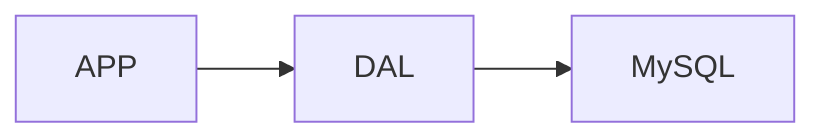
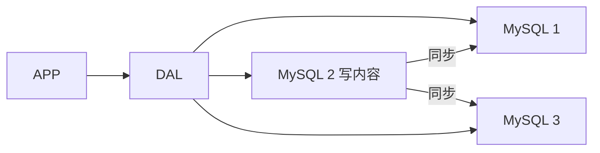
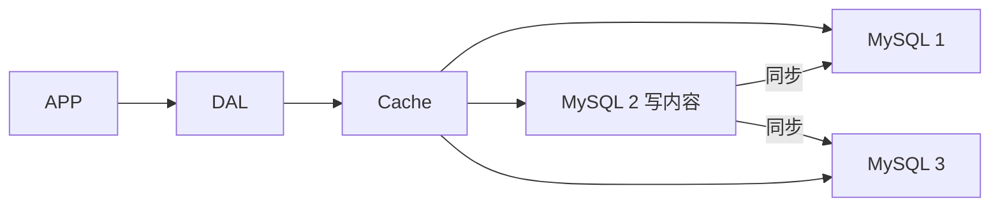
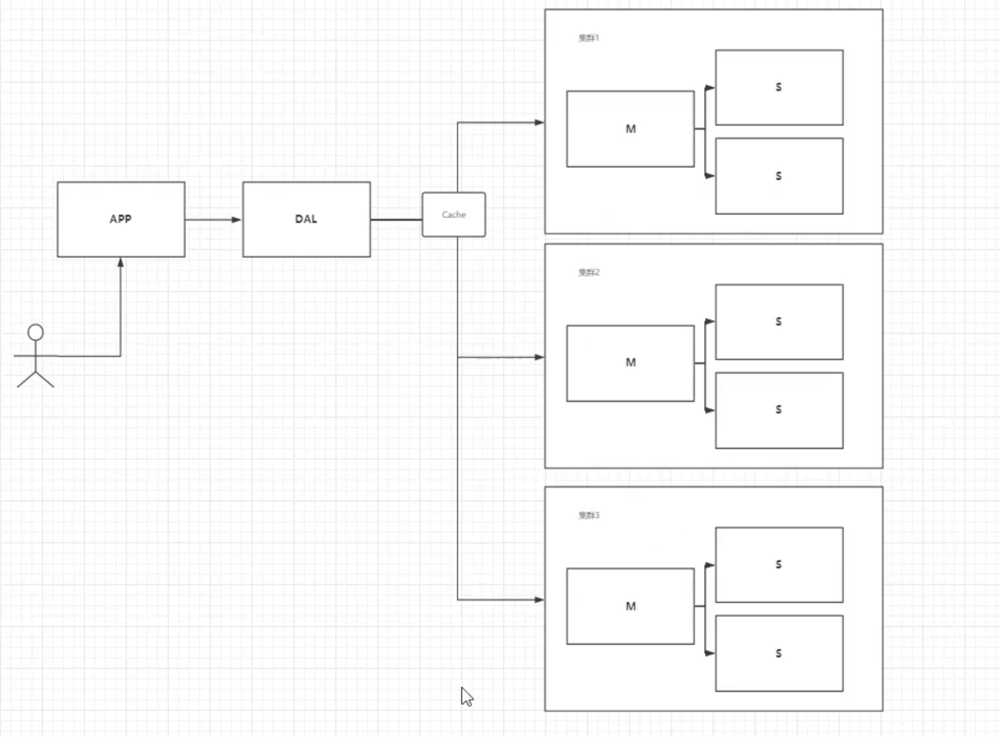
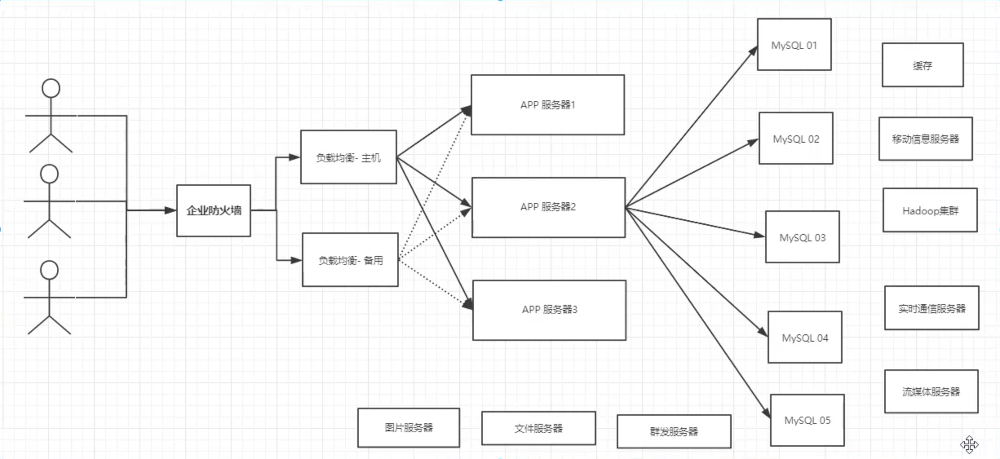

[toc]

# NoSQL概述

</br>

## 1、单机NoSQL





**单机**的瓶颈：

1. 数据量太大，一个机器放不下
2. 数据的索引太多，一个机器内存放不下
3. 访问量（读写混合），一个服务器承受不了


## 2、Memcached（缓存）+ MySQL + 垂直拆分（读写分离）

> 读写分离：
>
> 写操作都通过MySQL2完成，MySQL1和MySQL3负责同步过去，读操作都在1和3完成



> 实际情况中大部分操作都是读操作，每次去数据库查询十分消耗效率，所以可以通过缓存提高效率。(Cache保存最近一次修改后的数据库 )



## 3、分库分表 + 水平拆分 + MySQL集群


早些年MyISAM：表锁，影响效率，高并发下出现严重的锁问题

InnoDB：行锁

慢慢开始使用分库分表解决 **写** 的压力

MySQL推出了：

\* 表分区 （被弃用）

\* Mysql集群



## 4、现在

> 大数据时代 关系型数据库以及不满足需要
>
> 目前一个基本的互联网项目：




# 什么是NoSQL

> NoSQL
>
> NoSQL = Not Only SQL (不仅仅是SQL)
>
> 关系型数据库：表格，行，列
>
> 泛指非关系型数据库的，随着web2.0互联网的诞生，传统的关系型数据库很难对付，尤其对于超大规模的高并发的社区
>
> 很多的数据类型用户的个人信息，社交网络，地理位置。这些数据类型的储存不需要一个固定的格式。不需要过多的操作就可以横向扩展

```java
Map<String, Object>
```


## NoSQL特点


### 1. 方便扩展（数据之间没有关系，很好扩展）


### 2. 大数据量高性能 （Redis一秒写8万次，读取11万次，NoSQL的缓存记录级，是一种细粒度的缓存，性能会比较高）


### 3. 数据类型是多样型的 （不需要事先设计数据库 随取随用。如果是数据量十分大的表，很多人就都无法设计了）


### 4. 传统RDBMS和NoSQL

> 传统的RDBMS
>
> - 结构化组织
>
> - SQL
>
> - 数据和关系都存在单独的表中
>
> - 数据操作，数据定义语言
>
> - 严格的一致性
>
> - 基础的事务
>
> - ……


> NoSQL
>
> - 不仅仅是数据
>
> - 没有固定的查询语言
>
> - 键值对存储，列存储，文档存储，图形数据库（社交关系）
>
> - 最终一致性
>
> - CAP定理 和 BASE（异地多活）
>
> - 高性能，高可用，高可扩
>
> - ……


## 了解：3V+3高


### 大数据时代的3V：（主要描述问题）

> - 海量Volume
> - 多样Variety
> - 实时Velocity

### 互联网需求的3高 （主要是对程序的要求）

> - 高并发
> - 高可扩（随时水平拆分，机器不够随时加 集群）
> - 高性能

真正在公司中的实践：NoSQL + RDBMS


# NoSQL的四大分类


##  KV键值对

- 新浪：Redis
-  美团：Redis + Tair

- 阿里、百度：Redis + memcache

## 文档型数据库

- MongoDB

- MongoDB是一个基于分布式文件存储的数据库，C++编写，主要用来处理大量的文档！\- MongoDB是一个介于关系型数据库和非关系型数据库中间的产品\- MongoDB是非关系型数据库中功能最丰富，最像关系型数据库的

- ConthDB


## 列存储数据库

- HBase
- 分布式文件系统

## 图关系数据库

- 不是存图形，存的是关系，比如：朋友圈社交网络，广告推荐

- Neo4j，InfoGrid

## 四者对比


| 分类                | Examples举例                                       | 典型应用场景                                                 | 数据模型                                     | 优点                                                         | 缺点                                                         |
| ------------------- | -------------------------------------------------- | ------------------------------------------------------------ | -------------------------------------------- | ------------------------------------------------------------ | ------------------------------------------------------------ |
| 键值（Key-Value）   | Tokyo Cabinet/Tyrant, Redis, Voldemort, Oracle BDB | 内容缓存，主要用于处理大量数据的高访问负载，也用于一些日志系统等等。 | Key指向Value的键值对，通常用hash table来实现 | 查找速度快                                                   | 数据无结构化，通常只被当做字符串或者二进制数据               |
| 列存储数据库        | Cassandra, HBase, Rlak                             | 分布式的文件系统                                             | 以列簇式存储，将同一列数据存在一起           | 查找速度快，可扩展性强，更容易进行分布式扩展                 | 功能相对局限                                                 |
| 文档型数据库        | CouchDB，MongoDB                                   | Web应用（与Key-Value类似，Value是结构化的，不同的是数据库能够了解Value的内容） | Key-Value对应的键值对，Value为结构化数据     | 数据结构要求不严格，表结构可变，不需要像关系型数据库一样需要预先定义表结构 | 查询性能不高，而且缺乏统一的查询语法                         |
| 图形（Graph）数据库 | Neo4J，InfoGrid，Infinite Graph                    | 社交网络，推荐系统等。专注于构建关系图谱                     | 图结构                                       | 利用图结构相关算法。比如最短路径寻址，N度关系查找等          | 很多时候需要对整个图做计算才能得出需要的信息，而且这种结构不太好做分布式的集群方案 |